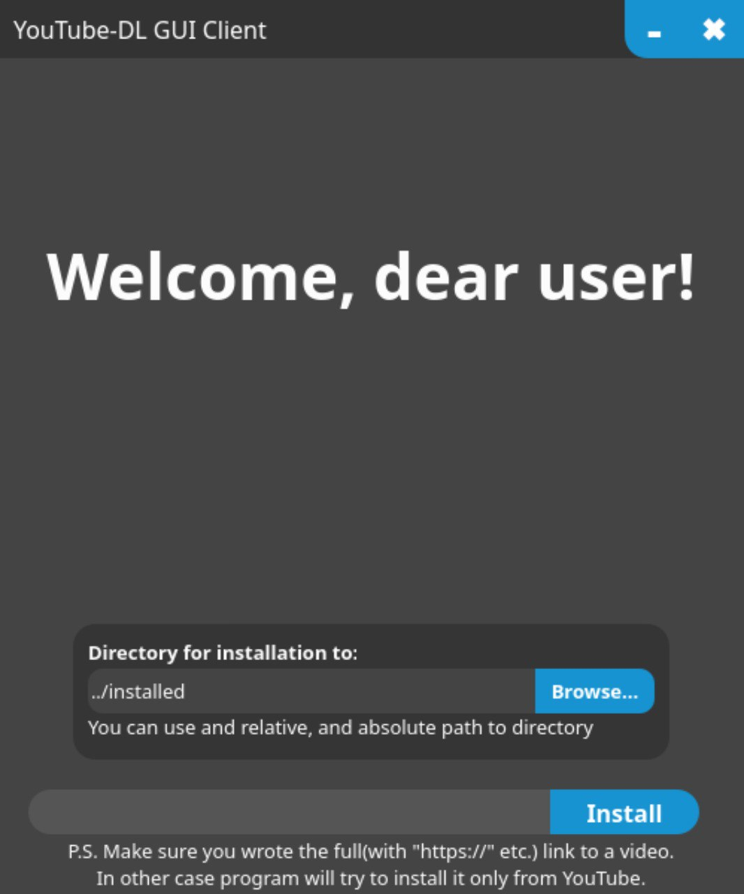

# YouTube-DL-GUI-Client
GUI Client for youtube-dl. Written on C++ and Qt(open-source)

## Installation & initialization
1. install ```qmake``` and [youtube-dl](https://github.com/ytdl-org/youtube-dl);
1. execute ```qmake``` in ```Program/``` directory(it'll make ```Makefile```);
1. execute ```make```(it'll run ```Makefile```);
1. done.
